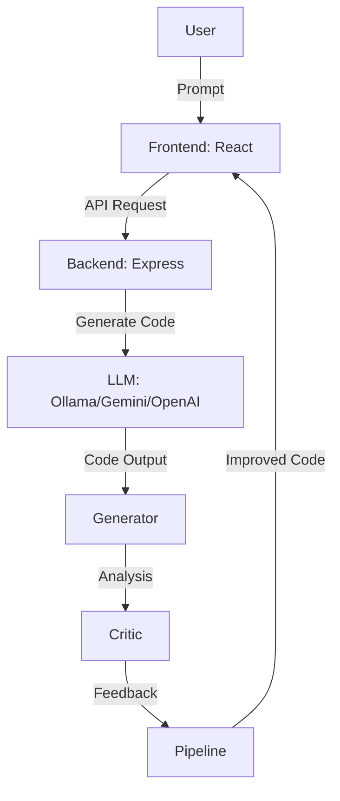
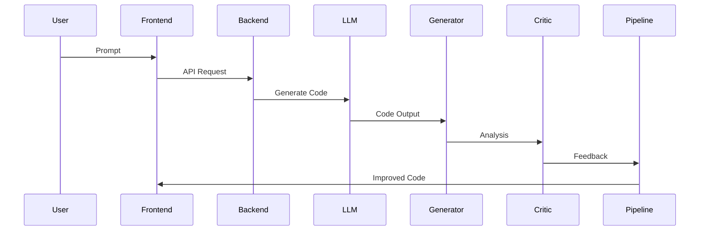

# Architektura AI Dev Environment

## Diagram C4 (Mermaid)

## Przepływ danych

1. Użytkownik wysyła prompt przez frontend (React/Next.js).
2. Frontend wysyła żądanie do backendu (Express API).
3. Backend przekazuje prompt do LLM (Ollama, Gemini, OpenAI, itp.).
4. Wynik trafia do generatora, następnie do krytyka (analiza, feedback).
5. Pipeline zwraca poprawiony kod do użytkownika.

## Komponenty
- **Frontend**: React/Next.js dashboard
- **Backend**: Express API, orchestrator, security, deployment
- **LLM**: Ollama, Gemini, OpenAI (modularnie)
- **Generator/Critic**: Moduły core (generator_critic.py, improver.py, tester.py)
- **Monitoring**: Prometheus, Grafana
- **Infrastruktura**: Docker, Kubernetes, CI/CD

## Rozszerzenia chmurowe
- Wrażliwe dane lokalnie, obliczenia w chmurze (hybryda)
- K8s deployment, autoskalowanie, monitoring

## Przykładowy przepływ requestu

